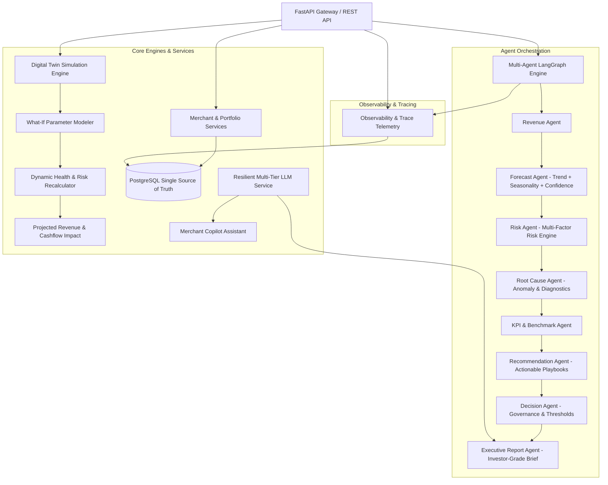

# RazorMind AI: Buildathon-Winning Transformation Plan

## Executive Overview
RazorMind AI is being transformed from a prototype dashboard into a production-grade, enterprise-ready **AI Merchant Intelligence Platform** comparable to Stripe Radar, Shopify Analytics, and Razorpay Risk Intelligence.

This plan resolves every hardcoded value, empty agent, broken route, database discrepancy, and UI limitation uncovered during our comprehensive architectural audit.

---

## Codebase Audit Findings

| Category | Discovered Issue | Solution |
|---|---|---|
| **Hardcoded Outputs** | `forecast_agent.py` returned hardcoded `[793455, 797654, 801853]`; `decision_agent.py` checked `avg_forecast > 700000`; `simulate.py` applied static `* 1.10`; `pdf_report.py` hardcoded recommendations. | Build dynamic Statistical & ML-based forecast engine, multi-factor decision engine, and parameterized simulation model. |
| **Empty / Broken Agents** | `kpi_agent.py`, `rootcause_agent.py`, `simulation_agent.py` were 0 bytes; `churn_agent.py` was a script hardcoding `M0001`; `final_report_agent.py` had syntax/name errors. | Implement all 14 agents with dynamic calculation, structured output schemas, explainability, confidence scoring, and execution tracing. |
| **Duplicate / Broken Routes** | Route collisions on `/merchant/{id}/forecast`, `/merchant/{id}/churn`, `/simulate`; duplicate imports and router inclusions in `app.py`; `traces.py` ignored `merchant_id` in queries and failed to persist it. | Consolidate and modularize all FastAPI routes with Pydantic request/response schemas, consistent error handling, and proper logging. |
| **LangGraph Workflow Flaws** | `langgraph_workflow.py` omitted the `decision` node leading to `KeyError: 'decision_data'`; `langgraph_routes.py` accessed missing `final_report` key. | Unify LangGraph pipeline to execute `Revenue -> Forecast -> Risk -> RootCause -> Recommendation -> Decision -> ExecutiveReport`, fully saving to DB. |
| **Database vs CSV** | Postgres `merchants` table lacked 8 KPI columns; `revenue_forecast.csv` only had 4 merchants; PostgreSQL was underutilized. | Extend SQLAlchemy models, migrate all 500 merchants with full KPI profiles into PostgreSQL, and make DB the single source of truth with graceful in-memory fallbacks. |
| **LLM Resilience** | Unhandled ChatOllama failures/timeouts without fallbacks; hardcoded model names (`llama3.2:3b` vs `qwen2.5:3b`). | Create a resilient `LLMService` with multi-tier fallback (Ollama -> OpenAI/Gemini -> High-Fidelity Heuristic Synthesis) ensuring 100% uptime. |
| **Frontend Limitations** | Single monolithic view with missing sub-pages and missing `react-markdown` in package.json; basic charts. | Upgrade to elite SaaS UI (Stripe Radar/Linear theme) with tabs for Merchant Intelligence, Risk Engine & Root Cause, Digital Twin Sandbox, Forecasting Lab, Action Plan, Executive Report, Observability/Traces, and Copilot. |

---

## Proposed Technical Architecture

---

## Detailed File-by-File Implementation Plan

### 1. Database & Models (`backend/models.py`, `database/`)
- **[MODIFY] [models.py](file:///e:/razormind-ai/backend/models.py)**:
  - Add comprehensive columns to `Merchant`: `total_transactions`, `active_customers`, `repeat_customers`, `avg_order_value`, `revenue_score`, `retention_score`, `risk_score`, `merchant_status`, `category`, `industry`.
  - Add `RootCauseRecord`, `SimulationLog`, `ActionPlanRecord`, and enhance `AgentExecution` with indexed `merchant_id`, `metadata_json`, and status metrics.
- **[MODIFY] [migrate_csv_to_postgres.py](file:///e:/razormind-ai/database/migrate_csv_to_postgres.py)**:
  - Migrate all 500 merchants with full KPI records and precompute baseline forecasts into PostgreSQL.

### 2. Resilient Core Services (`backend/services/`)
- **[NEW] [llm_service.py](file:///e:/razormind-ai/backend/services/llm_service.py)**:
  - Unified multi-model LLM engine: attempts ChatOllama with fast timeout, falls back to OpenAI/Gemini if keys exist, and provides an expert deterministic reasoning engine if offline.
- **[NEW] [risk_service.py](file:///e:/razormind-ai/backend/services/risk_service.py)**:
  - Professional risk scoring engine evaluating failure rates, refund velocity, churn probability, revenue volatility, customer concentration, and retention decline with explainability scorecards.
- **[NEW] [forecast_service.py](file:///e:/razormind-ai/backend/services/forecast_service.py)**:
  - Statistical & ML forecasting using exponential smoothing, linear trend with seasonality, and 95% confidence intervals (low/mid/high bounds).
- **[NEW] [simulation_service.py](file:///e:/razormind-ai/backend/services/simulation_service.py)**:
  - Multi-variable digital twin simulation model: adjusts success rate, refund rate, churn reduction, retention boost, and volume shift to output full simulated KPI rebalancing.
- **[NEW] [churn_service.py](file:///e:/razormind-ai/backend/services/churn_service.py)**:
  - ML-backed churn probability calculator with feature importance breakdown.

### 3. Agent Layer Overhaul (`agents/`)
Every agent upgraded with execution tracing, dynamic calculations, confidence scores, and structured output:
- **[MODIFY] [revenue_agent.py](file:///e:/razormind-ai/agents/revenue_agent.py)**: Pulls merchant metrics from PostgreSQL; calculates growth rate, AOV, transaction velocity.
- **[MODIFY] [forecast_agent.py](file:///e:/razormind-ai/agents/forecast_agent.py)**: Dynamic 30/60/90/180-day forecast with confidence bands and trend slope.
- **[MODIFY] [risk_agent.py](file:///e:/razormind-ai/agents/risk_agent.py)**: Multi-factor risk engine with factor weights, risk category, and risk breakdown.
- **[MODIFY] [churn_agent.py](file:///e:/razormind-ai/agents/churn_agent.py)**: Proper callable agent evaluating churn probability and risk indicators.
- **[NEW] [rootcause_agent.py](file:///e:/razormind-ai/agents/rootcause_agent.py)**: Pinpoints primary root causes of merchant distress/risk with severity and evidence.
- **[NEW] [kpi_agent.py](file:///e:/razormind-ai/agents/kpi_agent.py)**: Benchmarks merchant metrics against cohort percentiles.
- **[MODIFY] [recommendation_agent.py](file:///e:/razormind-ai/agents/recommendation_agent.py)**: Dynamic prescriptive actions tailored to merchant risk factors with estimated business impact ($ lift).
- **[MODIFY] [decision_agent.py](file:///e:/razormind-ai/agents/decision_agent.py)**: Multi-criteria decision engine (`APPROVE`, `APPROVE WITH MONITORING`, `MONITOR CLOSELY`, `HIGH RISK`, `REJECT/INTERVENE`) with rationale and audit score.
- **[MODIFY] [copilot_agent.py](file:///e:/razormind-ai/agents/copilot_agent.py)**: Context-aware copilot answering risk, revenue, churn, KYC, and simulation queries.
- **[MODIFY] [digital_twin_agent.py](file:///e:/razormind-ai/agents/digital_twin_agent.py)**: Digital twin engine simulating parameter shifts on revenue, health, churn, and forecast.
- **[MODIFY] [action_plan_agent.py](file:///e:/razormind-ai/agents/action_plan_agent.py)**: Dynamic 30-day tactical roadmap with milestone checkpoints and expected ROI.
- **[MODIFY] [executive_report_agent.py](file:///e:/razormind-ai/agents/executive_report_agent.py)**: Investor-grade structured executive report with confidence score and breakdown.
- **[MODIFY] [final_report_agent.py](file:///e:/razormind-ai/agents/final_report_agent.py)**: Aggregates full multi-agent payload into unified intelligence document.
- **[NEW] [simulation_agent.py](file:///e:/razormind-ai/agents/simulation_agent.py)**: Wrapper for scenario simulation agent.

### 4. Graph Orchestration (`graphs/`)
- **[MODIFY] [merchant_graph.py](file:///e:/razormind-ai/graphs/merchant_graph.py)** & **[langgraph_workflow.py](file:///e:/razormind-ai/graphs/langgraph_workflow.py)**:
  - Update StateGraph with full node sequence: `revenue -> forecast -> risk -> rootcause -> recommendation -> decision -> executive_report`.
  - Fix state schemas and ensure `save_analysis` writes complete records to DB.
- **[MODIFY] [nodes.py](file:///e:/razormind-ai/graphs/nodes.py)**:
  - Clean up debug statements, add proper structured tracing to `agent_executions`, handle errors gracefully.

### 5. Backend Routes & FastAPI Gateway (`backend/routes/`, `backend/app.py`)
- **[MODIFY] [app.py](file:///e:/razormind-ai/backend/app.py)**:
  - Clean duplicate imports, deduplicate router inclusions, add `/health`, `/metrics`, and unified API prefixing.
- **[MODIFY] [traces.py](file:///e:/razormind-ai/backend/routes/traces.py)**:
  - Fix `save_agent_trace` to store `merchant_id` in `AgentExecution.merchant_id` column.
  - Filter `get_traces(merchant_id)` properly by `merchant_id` with optional limit and summary stats.
- **[MODIFY] [merchant.py](file:///e:/razormind-ai/backend/routes/merchant.py)**, **[forecast.py](file:///e:/razormind-ai/backend/routes/forecast.py)**, **[churn.py](file:///e:/razormind-ai/backend/routes/churn.py)**, **[simulate.py](file:///e:/razormind-ai/backend/routes/simulate.py)**:
  - Remove route collisions; add Pydantic schemas, input validation, and proper HTTP response models.
- **[NEW] [rootcause.py](file:///e:/razormind-ai/backend/routes/rootcause.py)**: Endpoint for root cause diagnostics.
- **[MODIFY] [pdf_report.py](file:///e:/razormind-ai/backend/routes/pdf_report.py)**:
  - Generate beautiful, professional PDF reports with dynamic merchant data, risk assessment, forecast chart, and action plan.

### 6. Frontend SaaS Transformation (`frontend/`)
- **[MODIFY] [package.json](file:///e:/razormind-ai/frontend/package.json)**:
  - Ensure all required dependencies are installed (`react-markdown`, etc.).
- **[MODIFY] [App.jsx](file:///e:/razormind-ai/frontend/App.jsx)** & **[App.css](file:///e:/razormind-ai/frontend/App.css)**:
  - Elite SaaS navigation bar with tabs:
    1. **Overview & Dashboard**: Health gauge, live metrics, revenue momentum, recent decisions.
    2. **Risk & Root Cause Engine**: Multi-factor breakdown, failure diagnostics, anomaly detection.
    3. **Forecasting & Revenue Lab**: Dynamic 3-month forecast with 95% confidence bands and scenario curves.
    4. **Digital Twin Simulator**: Interactive sliders for success rate, refund rate, churn, volume with live re-calculated metrics.
    5. **Action Plan & Roadmap**: Interactive 30-day plan with weekly checklist, milestone trackers, and ROI estimates.
    6. **Executive Intelligence**: Investor-grade report modal, PDF download, and AI decision breakdown.
    7. **Observability & Agent Tracing**: Live telemetry, execution latencies, LangGraph interactive graph visualization.
    8. **RazorMind Copilot**: Intelligent AI assistant with quick prompts (Risk analysis, Revenue growth, Refund reduction).
  - Add merchant search with instant autocomplete across 500 merchants.
  - Polished dark mode theme with glassmorphism, glowing accents, smooth transitions, and high readability.

---

## Verification Plan

### Automated Backend Verification
- Run database migration and verification script:
  `python database/migrate_csv_to_postgres.py`
- Run comprehensive backend test suite testing every agent and endpoint:
  `python -m pytest` or `python test_suite.py` verifying all 14 agents, LangGraph pipeline, risk engine, forecast engine, digital twin, copilot, PDF generation.

### Frontend Build & End-to-End Verification
- Run `npm run build` in `frontend/` to confirm zero build errors or missing packages.
- Start FastAPI dev server (`uvicorn backend.app:app`) and frontend Vite server (`npm run dev`).
- Test core user workflows in browser:
  - Inspecting merchants (`M0001`, `M0002`, `M0050`, etc.).
  - Running Digital Twin simulations and verifying live recalculation.
  - Generating 30-Day Action Plan and Executive Report.
  - Testing Copilot chat queries.
  - Viewing Agent Traces and LangGraph execution pipeline.
